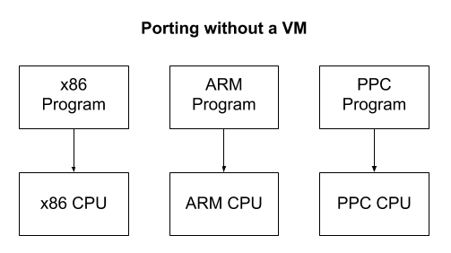
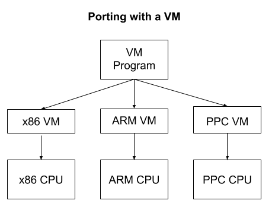

# VirtualMachine
Implementing a virtual machine in C basically a bunk version of something like the JVM 
While some virtual machines are meant to emulate servers this just emulates some basic instruction sets like ARM assembly

Wikipedia gives a good high level description about virtual machines https://en.wikipedia.org/wiki/Virtual_machine
More programming based description on virtual machines                 https://justinmeiners.github.io/lc3-vm/#1:9

  
  

